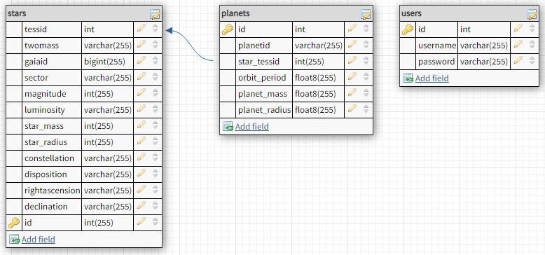

# Tess-BE

##Backend Repo for the Planets-with-TESS
Developer: Michael Falahee
Github: http://www.github.com/Mjfalahee

###Table Schema

Stars:
..*tessid = unique id, PK

Light Curves:

Planets: 

Users:
..*Username
..*Password (hashed)

dummyData

planet: id, name, distance, lumosity, spectrum, metallicity, variability

endpoints are:
.post https://build-week-tess.herokuapp.com/auth/register --returns a message, and the newly registered user
.post https://build-week-tess.herokuapp.com/auth/login -- returns a message and a token for future restricted routes